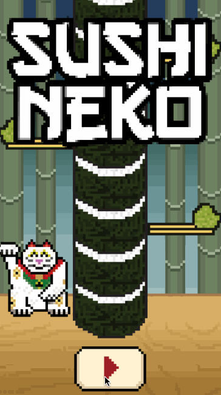

In this tutorial we will build Sushi Neko -- a clone of the popular mobile game [Timberman](https://itunes.apple.com/us/app/timberman/id871809581?mt=8). We will use Apple's new Swift programming language together with SpriteBuilder and Cocos2D.

<!-- If you aren't familiar with SpriteBuilder you should read our [SpriteBuilder beginner tutorial](https://www.makeschool.com/tutorials/getting-started-with-spritebuilder-and-swift/installing-spritebuilder) first since this tutorial assumes that you are familiar with basic SpriteBuilder tasks. Make sure you have both SpriteBuilder and Xcode installed! -->

#What you will learn

Throughout this tutorial you will learn many concepts including how to:

- Effectively use SpriteBuilder to prototype a game
- Use property observers in Swift
- Create complex animations
- Add visual effects

#The finished product

We'll start off by making a "discrete" version of Timberman. The core gameplay will be present but there will be no fancy animations.

After we finish this basic but playable version we will spend some time polishing up the game. We'll add in a title screen, game over popup and animations.

Let's get started with a blank SpriteBuilder project!
