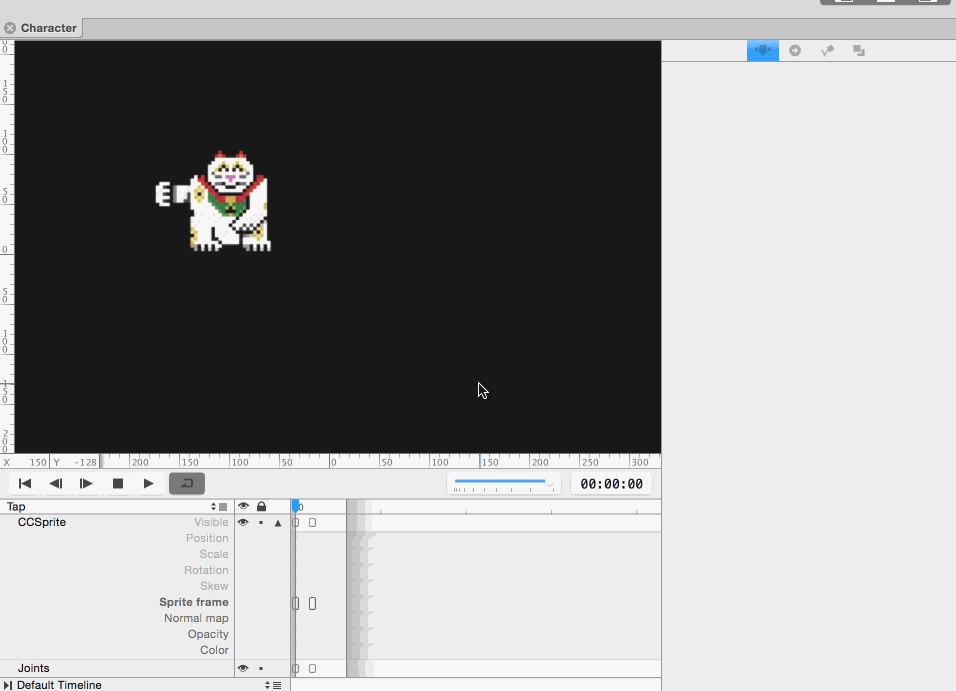
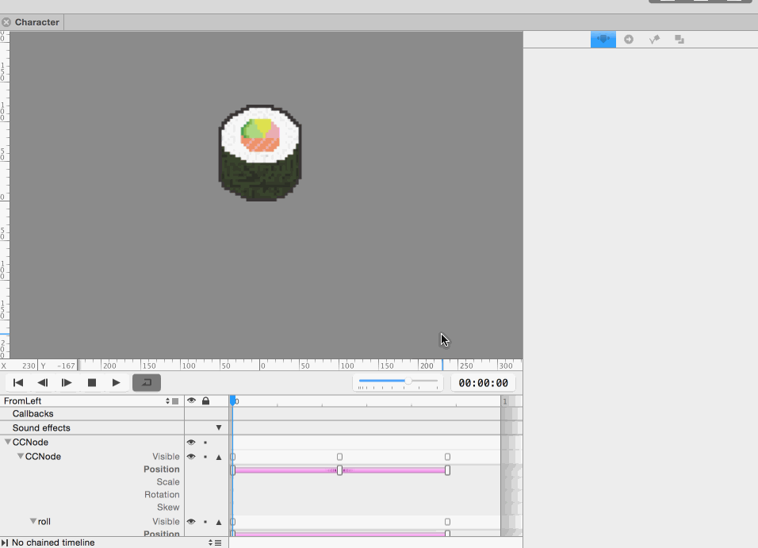
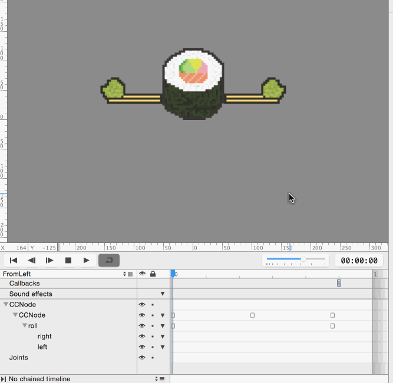
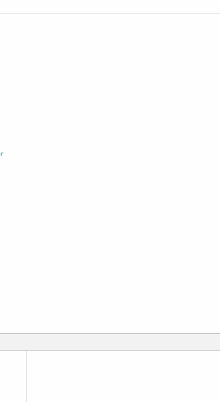
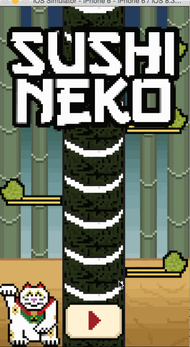

---
title: "Getting fancy with more animations"
slug: game-object-animations
---     

#Animating the cat

We'll be using a sprite frame animation for the cat. Sprite frame animations  change out the sprite and can allow for more complex animations with the trade off of taking up more memory.

##Setting up the timelines

The default timeline does not need to be changed since the cat will only move when there is a tap on the screen. We will need a separate timeline for the swipe.

> [action]
> Open up `Character.ccb`.
> 
> Create a new timeline named `Tap` with a length of `00:00:03`. Chain the timeline to `Default Timeline`

##Swipe animation

Now we can add our animation!

> [action]
> Add a sprite frame keyframe at `00:00:00`. To do this, select the root CCSprite. Drag the animation scrubber to `00:00:00` (even if it's already there, drag it somewhere else then back). Press `F` on your keyboard.
> 
> Move the scrubber to `00:00:01` and press `F` again to add another sprite frame keyframe.
> 
> Double click the first keyframe and set its *value* to `character2.png`. Double click the second keyframe and set its *value* to `character3.png`.
> 

Play the animation to check it out!

#Animating the sushi rolls

Let's start the animation for sushi rolls after they get swiped by the cat.

This movement will require a bit more complex of an animation. We'll actually have to change the structure of `Piece.ccb` in order to get it looking right!

##Setting up Piece.ccb

We need a separate node to handle vertical movement. If we animated everything from a single node, it would be impossible to get the correct movement since we want linear interpolation in the x-direction and non-linear interpolation in the y-direction (think about a ball moving when thrown in an arc).

> [action]
> Drag in a basic node and set its *position* to be `(50%, 0)`. Change `roll` to be a child of this new node. Change `roll`'s anchor point to `(.5, 0)` to ensure it's in the middle of the screen.

We'll be using this new node for vertical movement and animate `roll` for horizontal movement.

> [action]
> Create a new timeline named `FromLeft` with a duration of `00:01:00`.

##Animating FromLeft

Since you already have quite a bit of experience with keyframe animation, we'll be keeping the instructions sparse for this.

> [action]
> 
> Create position keyframes on the new node at `00:00:00`, `00:00:12`, and `00:00:24`. Change the middle keyframe's *value* to `(50%, 100)`. Add `Ease Out` interpolation to the first half and `Ease In` interpolation to the second half of the animation.
> 
> Now create position AND rotation (use `R` instead of `P`) keyframes on `roll` at `00:00:00` and `00:00:24`. Set the *value* of the second position keyframe to `(400, 0)`. Set the *value* of the second rotation keyframe to `180`.
> 
> Move the scrubber to `00:00:25` and Option + Click in the `Callbacks` row of the timeline. This will allow you to call a method at a specific time in an animation. Double click the new callback keyframe and set its *value* to `removeFromParent`. The piece will now be removed from the scene when its animation is finished.
> 

##Animating FromRight

FromRight is very similar to FromLeft.

> [action]
> Create a new timeline named `FromRight` with a duration of `00:01:00`.
> 
> Create position keyframes on the new node at `00:00:00`, `00:00:12`, and `00:00:24`. Change the middle keyframe's *value* to `(50%, 100)`. Add `Ease Out` interpolation to the first half and `Ease In` interpolation to the second half of the animation.
> 
> Now create position AND rotation keyframes on `roll` at `00:00:00` and `00:00:24`. Set the *value* of the second position keyframe to `(-400, 0)`. Set the *value* of the second rotation keyframe to `-180`.
> 
> Move the scrubber to `00:00:25` and Option + Click in the `Callbacks` row of the timeline. Double click the new callback keyframe and set its *value* to `removeFromParent`.

##Perfecting the Animation
Before you move on, check the visibility for the `left` and `right` chopsticks so you can see them both, then run one of the rolling animations. Why aren't the chopsticks rolling with the sushi?

We originally built our game without animations, so we didn't need to think about relative positioning. However, now that things are moving around, we *do* need to think about relative positioning. Let's look back at what we just did; we made the sushi roll a child of a `CCNode`. When we moved the node, the sushi roll followed. What do we need to do to make the chopsticks move with the roll?

> [solution]
> Drag `left` and `right` to be children of `roll` on the animation timeline.
> 
> 

Be sure to uncheck the chopsticks' visibility when you're done!

#Triggering the Animations From Code

The animations are ready to go so let's move over to Xcode.

##Cat swipes

The cat swipe animation is set to go back to default when finished. All we need to do is trigger it whenever the character moves.

> [action]
> Open up `Character.swift`.
> 
> Add the following method:
> 
>       func tap() {
>           self.animationManager.runAnimationsForSequenceNamed("Tap")
>       }
> 
> Open up `MainScene.swift` and add the following right before `stepTower` in `touchBegan`:
> 
>       character.tap()

This ensures that `tap` is only called if a valid move has been made and a piece is about to be swiped away. Run the game to see it in action!

##Flying sushi

Let's create a helper method to call whenever a sushi piece is successful hit.

> [action]
> Add the following method to `MainScene`:
> 
>       func addHitPiece(obstacleSide: Side) {
>           var flyingPiece: Piece = CCBReader.load("Piece") as! Piece
>           flyingPiece.position = addPiecePosition!
>
>           var animationName = character.side == .Left ? "FromLeft" : "FromRight"
>           flyingPiece.animationManager.runAnimationsForSequenceNamed(animationName)
>           flyingPiece.side = obstacleSide
> 
>           self.addChild(flyingPiece)
>       }

This method loads in a new piece, runs the correct animation, and adds it to the scene. However, you'll notice we haven't yet defined `addPiecePosition`:
> [action]
> Add the following line to `MainScene` with your other instance variable declarations:
> 		
> 		var addPiecesPosition: CGPoint?
> 
> Add the following method above `didLoadFromCCB()` in `MainScene`:
> 
> 		override func onEnter() {
   	 		super.onEnter()
    		addPiecesPosition = piecesNode.positionInPoints
  		}
>
> The order of method calls at the creation of a SpriteBuilder object is `init()` -> `didLoadFromCCB()` -> `onEnter()`. Defining `addPiecesPosition` in `onEnter()` ensures that the position value has been fully defined for all of our nodes.

Now we just need to trigger it appropriately.

> [action]
> After `var piece = pieces[pieceIndex]` in `stepTower` add:
> 
>       addHitPiece(piece.side)

Run the game to check out all your fancy animations!

##Perfecting the Animation

All of our animations look great, but the stack still drops instantaneously - there is never a gap where you just punched the sushi out. We can fix that in code as well:

> [action]
> Replace the `piecesNode.position = ccpSub(piecesNode.position,
      CGPoint(x: 0, y: piece.contentSize.height))` in `stepTower()` with:
>
>		var movePiecesDown = CCActionMoveBy(duration: 0.15, position: CGPoint(x: 0, y: -piece.contentSize.height))
> 		piecesNode.runAction(movePiecesDown)

All this does is move the stack down over the course of 0.15 seconds, but the result is a much more fluid looking game.

